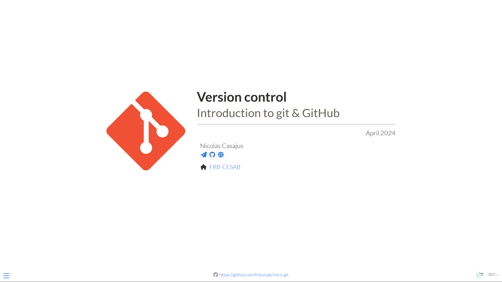

<h1 align="center">
  <br>
  <a href="https://frbcesab.github.io/intro-git"></a>
  <br>Version control w/ git<br>
</h1>

<br>

<p align="center">
  <a href="https://frbcesab.github.io/intro-git" target="_blank"><b>frbcesab.github.io/intro-git</b></a></h4>
</p>

<p align="center">
  <a href="https://quarto.org/">
    
  </a>
  <a href="https://choosealicense.com/licenses/cc-by-4.0/">
    
  </a>
  <br/>
  <a href="https://github.com/FRBCesab/intro-git/actions/workflows/pages/pages-build-deployment">
    
  </a>
</p>

<p align="center">
  <a href="#content">Content</a> •
  <a href="#contribute">Contribute</a> •
  <a href="#citation">Citation</a> •
  <a href="#code-of-conduct">Code of Conduct</a>
</p>




<br>


## Content

This online presentation, available at [**frbcesab.github.io/intro-git**](https://frbcesab.github.io/intro-git)
provides a quick introduction to version control with `git` and GitHub.


<br>


## Contribute

### System requirement

- [R](https://cran.r-project.org/)
- [RStudio](https://posit.co/download/rstudio-desktop/)
- [Quarto](https://quarto.org/)

### Edit slides

- Clone this repository

```sh
## Using the SSH protocol ----
git clone git@github.com:frbcesab/intro-git.git

## Using the HTTPS protocol ----
git clone https://github.com/frbcesab/intro-git.git
```

- Install required packages

Required R packages are listed in the 
[`DESCRIPTION`](https://github.com/frbcesab/git-for-r-user/blob/main/DESCRIPTION)
file.

```r
## Install 'remotes' package (if necessary) ----
install.packages("remotes")

## Install required packages ----
remotes::install_deps()
```

- Edit the 
[`index.qmd`](https://github.com/frbcesab/intro-git/blob/main/index.Rmd) 
file or specific [chapters](https://github.com/frbcesab/intro-git/blob/main/slides/).

### Render HTML presentation

```r
## Render HTML presentation ----
quarto::quarto_render("index.qmd")
```


<br>


## Citation

Please cite this presentation as:

> Casajus N (2024) Version control with git and GitHub. URL: <https://frbcesab.github.io/intro-git>.


<br>


## Code of Conduct

Please note that this project is released with a
[Contributor Code of
Conduct](https://contributor-covenant.org/version/2/0/CODE_OF_CONDUCT.html).
By contributing to this project, you agree to abide by its terms.
