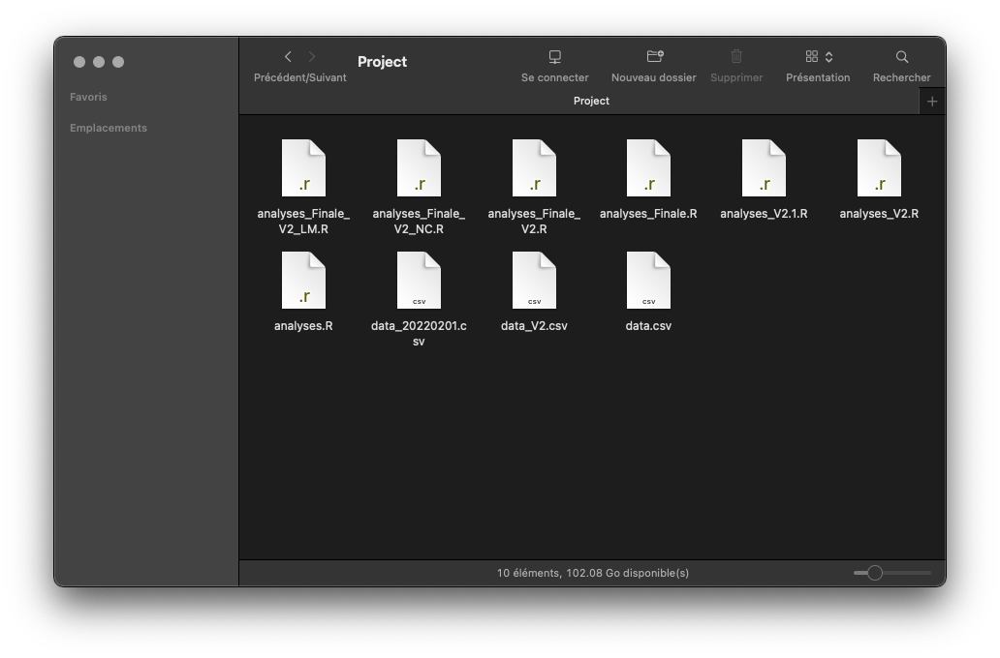
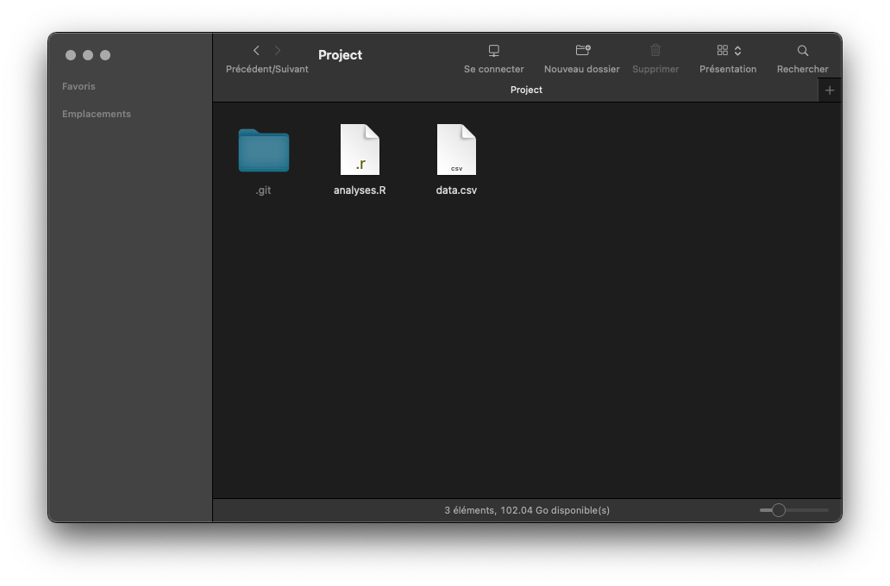
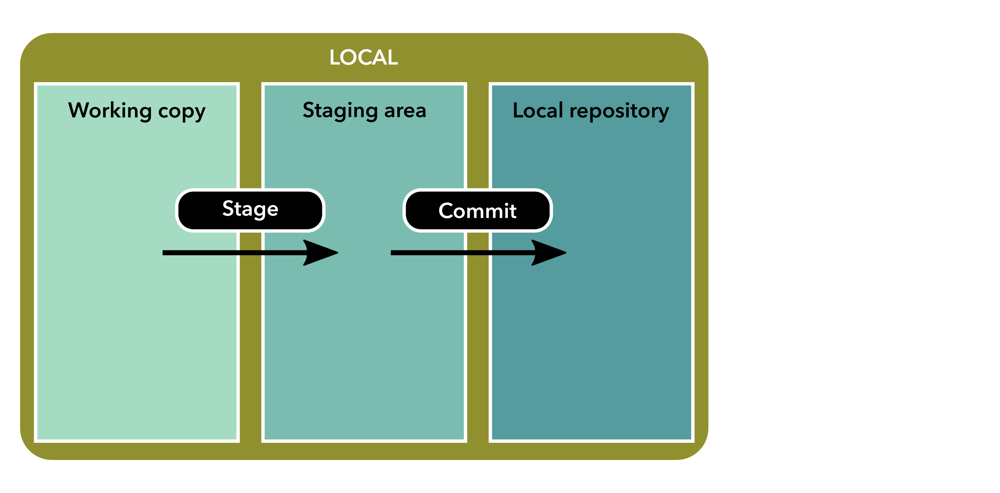
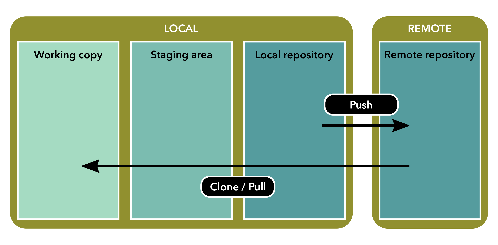
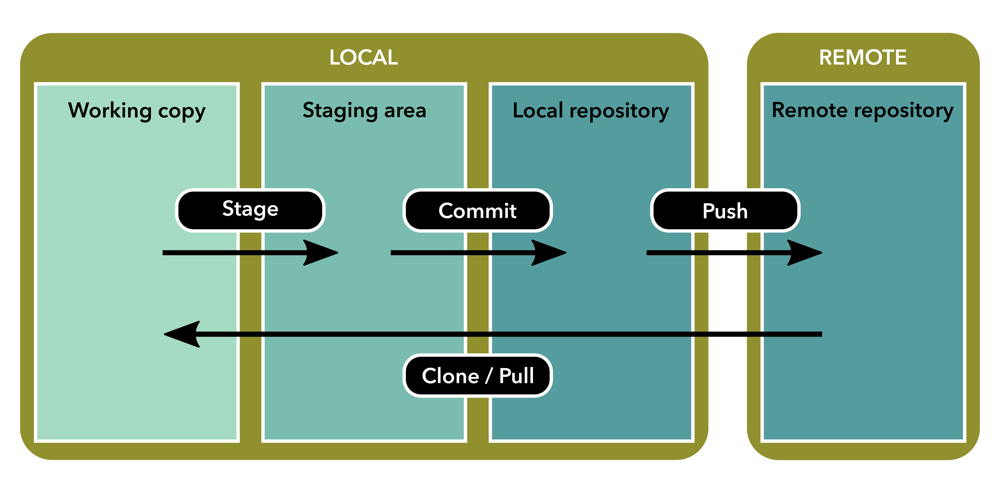

## Motivations

.pull-left[

]

--

.pull-right[
- Which version of `analyses.R` is the final one?
- What about `data.csv`?
- What are the differences between versions?
- It becomes difficult to find new versions names
- And this folder: what a mess!
]

--

We need a tool that deals with versions for us

--

<br>

.center[
`r fontawesome::fa_i("hand-point-right", class = "normal")` &nbsp;&nbsp;
`Version Control System`
&nbsp;&nbsp; `r fontawesome::fa_i("hand-point-left", class = "normal")`

[](https://git-scm.com/)
]


---


## Version Control System

.pull-left[

]


.pull-right[
With a `VCS` like &nbsp;`r fontawesome::fa_i("git")` &nbsp; you can:
]


---


## Version Control System

.pull-left[

]


.pull-right[
With a `VCS` like &nbsp;`r fontawesome::fa_i("git")` &nbsp; you can:
- archive and document your previous versions;
- keep an history of yours files
- backtrack to previous versions;
- handle multiple versions;
- keep your working copy clean.
]

--

`r fontawesome::fa_i("hand-point-right")` &nbsp;
Everything is managed by &nbsp;`r fontawesome::fa_i("git")` &nbsp;and stored in 
the hidden folder `.git/`
<br>(specific to a project)

--

`r fontawesome::fa_i("hand-point-right")` &nbsp;
The content of this folder is modified with `git commands` or GUI ([`RStudio`](https://www.rstudio.com/))
<br>(never by hand)


---

## A word of warning

<br />

.center[
`r fontawesome::fa_i("exclamation-triangle")` &nbsp;&nbsp;
`Git` and `GitHub` are **not** the same thing
&nbsp;&nbsp; `r fontawesome::fa_i("exclamation-triangle")`
]

<br />

--

- `Git` - a free and open-source software
- `GitHub` - a platform to host and share projects that use &nbsp;`r fontawesome::fa_i("git")`

<br />

--

In other words:

- You do not need `GitHub` to use &nbsp;`r fontawesome::fa_i("git")`
- But you cannot use `GitHub` without using &nbsp;`r fontawesome::fa_i("git")`

<br>

--

In the language of &nbsp;`r fontawesome::fa_i("git")`  &nbsp; `GitHub` and other 
platforms (`GitLab`, `BitBucket`, etc.) are called **`remotes`**


---


## The added value of using remotes

.pull-leftt[
.center[

]
]

.pull-rightt[
- Collaborate with others on your project
- Publish your project (reproducibility)
- Backup your project
- and many more...
]


---

## Terminology

.pull-left[
<dl> 
<dt><code>Working copy</code></dt>
<dd>Current state of the directory (what you actually see)</dd><br>
<dt><code>Stage</code></dt>
<dd>Selection of files/folders to be added to the next commit</dd><br>
<dt><code>Staging area</code></dt>
<dd>Files/folders that will be added to the next commit</dd><br>
<dt><code>Commit</code></dt>
<dd>A snapshot of staged file(s)</dd> 
</dl>
]

--

.pull-right[
<dl> 
<dt><code>Repository</code></dt>
<dd>The area with all the commits (i.e. the <code>.git/</code> subdirectory)</dd><br>
<dt><code>Clone</code></dt>
<dd>Action to locally copy a remote repository</dd><br>
<dt><code>Push</code></dt>
<dd>Action to send your changes to the remote repository</dd><br>
<dt><code>Pull</code></dt>
<dd>Action to retrieve changes from the remote repository</dd> 
</dl>
]


--

<br>
`r fontawesome::fa_i("hand-point-right")` &nbsp;
`r fontawesome::fa_i("git")` &nbsp;takes **snapshots** of a 
project and helps to navigate between them

---

## Basic workflow

<br><br>
.center[

]


---

## Basic workflow

<br><br>
.center[

]


---

## Basic workflow

<br><br>
.center[

]


---

## Basic workflow

<br><br>
.center[

]

---

## Commits

- Each point in the history is called a `commit`

--

<br>

- A commit contains:

  `r fontawesome::fa_i("hand-point-right")` a `WHO`: the person who made the commit;

  `r fontawesome::fa_i("hand-point-right")` a `WHEN`: the date of the commit;

  `r fontawesome::fa_i("hand-point-right")` a `WHAT`: which files have been modified;

  `r fontawesome::fa_i("hand-point-right")` a `WHY`: the reason of the commit 
(what has been done compared to the previous commit).


---

## Commits

- The `WHO` must be set once by the user (globally or locally) by running:

```sh
## Configuration of git for all the projects ----
$ git config --global user.name  "Jane Doe"
$ git config --global user.email "jane.doe@mail.com"

## Configuration of git just for this project ----
$ git config --local user.name  "Jane Doe"
$ git config --local user.email "jane.doe@mail.com"
```

<br>

--

- The `WHEN` is automatically managed by `r fontawesome::fa_i("git")`

<br>

--

- The `WHAT` corresponds to the file(s) manually staged by the user (`git add`)

<br>

--

- The `WHY` is called the `commit message`: it must be short, informative, and use
the imperative form


---

## Commits

.figure[

<br>.caption[Source: https://xkcd.com/1296/]
]


---

## Commits

- When to commit?

.figure[

<br>.caption[&#169; 2015 [Louis-Michel Couture](https://github.com/louim/in-case-of-fire)]
]

--

<br>

`r fontawesome::fa_i("hand-point-right")` &nbsp;
When you reach a milestone in your analysis

---

## Useful Git commands

`r fontawesome::fa_i("hand-point-right", )` &nbsp;
All `git` commands follow the same pattern: `git SUBCMD [ARGS]`

<br>

--

.pull-left[
```sh
## Initialize git for the project

## Or clone a remote repository

## Print the status of the working copy

## Print the versioning history

## Stage changes of one (or many) file

## Stage changes of all files

## Commit changes

## Send changes to a remote repo

## Retrieve changes from a remote repo
```
]

.pull-right[
```sh
$ git init

$ git clone <URL>

$ git status

$ git log (--oneline)

$ git add file_1 (file_2 folder_a)

$ git add -A

$ git commit -m "The commit message"

$ git push

$ git pull
```
]

and also: `diff` / `show` / `checkout` / `reset` / `merge` / `rebase` / `stash` ...


---

## Command lines or...

<br><br>
.center[

]
