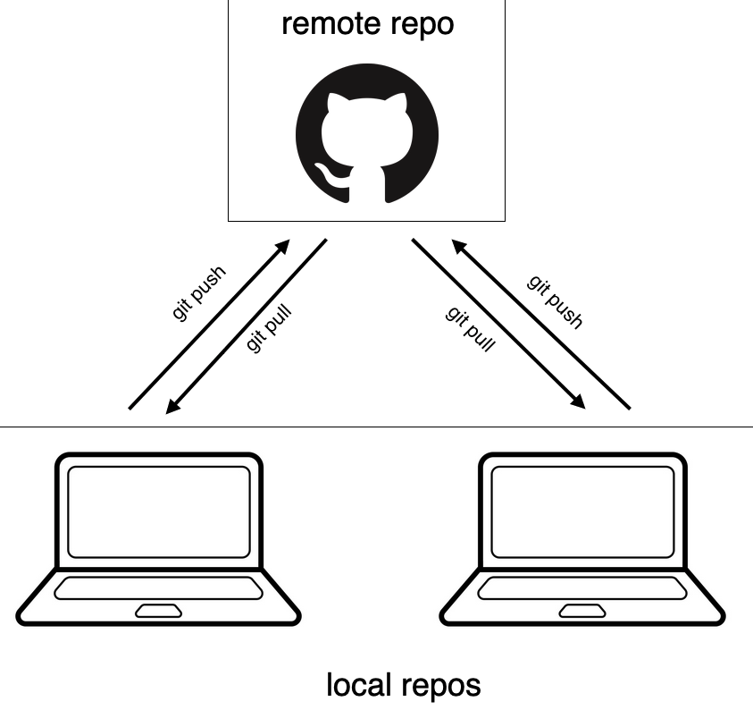

## Motivations

...


---


## Introduction

`r fontawesome::fa_i("hand-point-right", )` &nbsp;
`git` and `GitHub` are **not** the same thing

--

- `git` - an open-source version control software
- `GitHub` - a platform to host and share code using `git`

--

<br />

`r fontawesome::fa_i("hand-point-right", )` &nbsp;
You do not need `GitHub` to use `git`
<br/>
`r fontawesome::fa_i("hand-point-right", )` &nbsp;
But you cannot use `GitHub` without using `git`
<br/>
`r fontawesome::fa_i("hand-point-right", )` &nbsp;
`GitHub` (and others) will make sharing your code with others easier

--

<br />

`r fontawesome::fa_i("hand-point-right", )` &nbsp;
`GitHub` is the property of Microsoft
<br/>
`r fontawesome::fa_i("hand-point-right", )` &nbsp;
Some alternatives: `GitLab`, `BitBucket`, `Gittea`, etc.

--

<br />

`GitHub` (and others) are called `remotes`


---

## Version control

`r fontawesome::fa_i("hand-point-right", )` &nbsp;
`git` is a program that takes **snapshots** of a directory (project) and
helps navigating between those snapshots

--

- Archiving and documentation of development steps
- Backtracking to previous versions
- Handling of multiple versions
- Collaborative development (using remotes)
- Backup (using remotes)

--

Especially useful when making analyses, developing software, writing papers...

--

.center[

<br/>
`git` is a decentralized system
]


---

## Some definitions


`repository` - a directory including a `.git/` subdirectory

`commit` - a snapshot of the repository (a date, an author, a description)

`working copy` - a version of the files of the repository on a computer

--

<br />

`r fontawesome::fa_i("hand-point-right", )` &nbsp;
All `git` commands follow the same pattern:

```sh
git SUBCMD ARGS
```


---

## Some useful git commands

```sh
## Initialize git for a project ----
git init

## Get the status of the versioning ----
git status

## Stage one file ----
git add file_1

## Stage several file(s) ----
git add file_1 file_2 folder_a

## Stage all changes in all files ----
git add -A

## Commit changes ----
git commit -m "An explicit message that explains what has been done"

## Get git history ----
git log --oneline

## Show previous version of a file ----
git show commit_id:file

## Get differences from last version ----
git diff file
```

---

## git and GitHub

.center[

]


---

## git and GitHub


```sh
## Clone a repository from a remote ----
git clone git@github.com:github_account/repo_name
git clone https://github.com/github_account/repo_name

## Send changes to a remote ----
git push

## Retrieve changes from a remote ----
git pull
```


---

## Integration with

.center[

]
